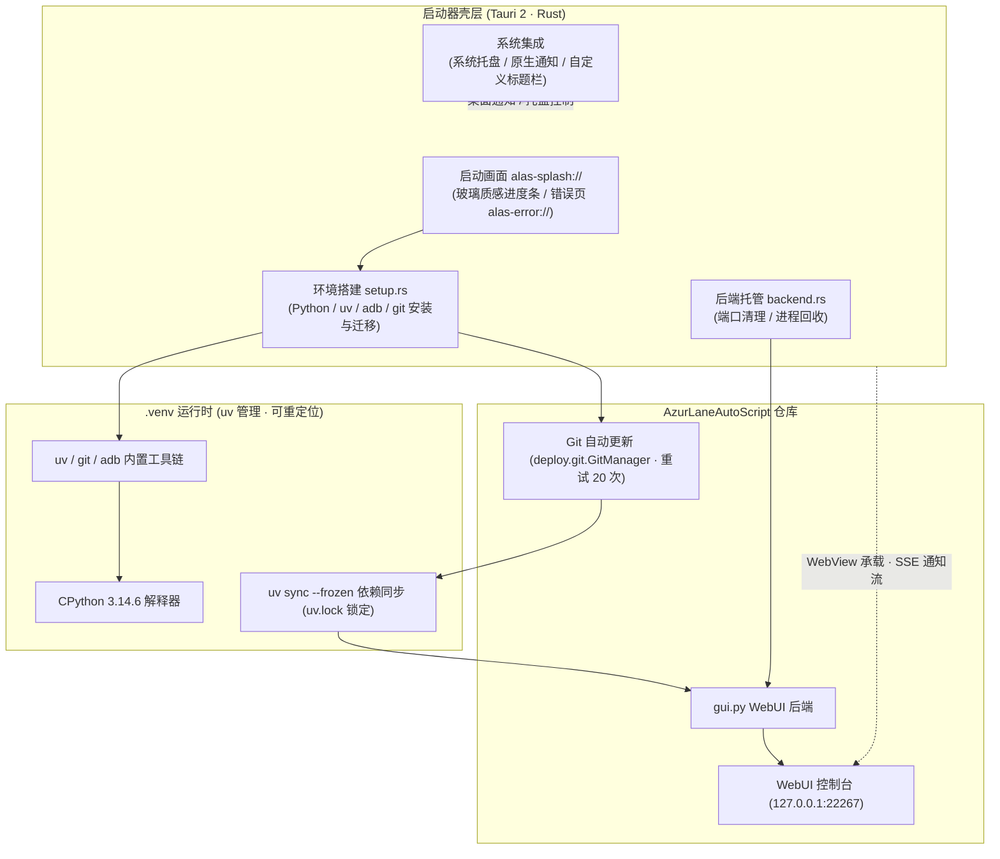

<div align="center">


# AzurPilot Launcher

**全平台原生运行 · 内置 Python 环境零配置 · 一键更新启动 AzurPilot**

全功能《碧蓝航线》自动化助手 [AzurPilot](https://github.com/wess09/AzurPilot)（基于 [AzurLaneAutoScript](https://github.com/LmeSzinc/AzurLaneAutoScript)）的跨平台桌面启动器，基于 Tauri 2 + Rust 构建，支持 Windows / macOS / Linux。

<p align="center">
  <b>简体中文</b> |
  <a href="README_en.md">English</a> |
  <a href="README_ja.md">日本語</a> |
  <a href="README_zh-TW.md">繁體中文</a>
</p>

---

<!-- 核心环境与平台标签组 -->
<p align="center">
  <a href="./LICENSE"></a>
  <a href="https://www.tauri.app/"></a>
  <a href="https://www.rust-lang.org/"></a>
  <a href="https://www.python.org/"></a>
  <a href="https://github.com/astral-sh/uv"></a>
  
</p>

<!-- 技术栈与框架标签组 -->
<p align="center">
  <a href="https://developer.mozilla.org/zh-CN/docs/Web/API/Web_Workers_API"></a>
  
  
  
  <a href="https://deepwiki.com/wess09/alas-launcher"></a>
</p>

<!-- 仓库动态与社区指标标签组 -->
<p align="center">
  <a href="https://github.com/wess09/alas-launcher/releases/latest"></a>
  <a href="https://github.com/wess09/alas-launcher/releases"></a>
  <a href="https://github.com/wess09/alas-launcher/stargazers"></a>
  <a href="https://github.com/wess09/alas-launcher/network/members"></a>
  <a href="https://github.com/wess09/alas-launcher/issues"></a>
  <a href="https://github.com/wess09/alas-launcher/commits/main"></a>
</p>

<p align="center">
  <a href="#项目总览与指标">项目总览</a> •
  <a href="#项目概述">项目概述</a> •
  <a href="#关联生态工程">关联生态</a> •
  <a href="#核心特性">核心特性</a> •
  <a href="#系统架构全景">系统架构</a> •
  <a href="#环境要求">环境要求</a> •
  <a href="#快速开始">快速开始</a> •
  <a href="#应用预览">应用预览</a> •
  <a href="#与原版启动器的区别">版本区别</a> •
  <a href="#目录结构">目录结构</a> •
  <a href="#研发活跃度">研发活跃</a> •
  <a href="#star-增长趋势">增长趋势</a> •
  <a href="#社区生态与支持">社区支持</a>
</p>

</div>

---

## 项目总览与指标

<table width="100%">
  <thead>
    <tr>
      <th colspan="4" align="left">
        
        <b>工程核心运行与研发指标</b>
      </th>
    </tr>
  </thead>
  <tbody>
    <tr>
      <td width="25%"><b>最新正式版</b><br><a href="https://github.com/wess09/alas-launcher/releases/latest"></a></td>
      <td width="25%"><b>累计下载量</b><br><a href="https://github.com/wess09/alas-launcher/releases"></a></td>
      <td width="25%"><b>开源许可证</b><br><a href="./LICENSE"></a></td>
      <td width="25%"><b>自动化构建</b><br><a href="https://github.com/wess09/alas-launcher/actions"></a></td>
    </tr>
    <tr>
      <td width="25%"><b>代码库体积</b><br></td>
      <td width="25%"><b>代码语言</b><br></td>
      <td width="25%"><b>运行时</b><br></td>
      <td width="25%"><b>界面语言</b><br></td>
    </tr>
    <tr>
      <td colspan="4">
        <b>快速操作快捷入口：</b>
        <a href="https://github.com/wess09/alas-launcher/releases/latest"></a>
        <a href="https://deepwiki.com/wess09/alas-launcher"></a>
        <a href="https://github.com/wess09/alas-launcher/issues/new/choose"></a>
        <a href="https://github.com/wess09/alas-launcher/pulls"></a>
        <a href="https://github.com/wess09/alas-launcher/stargazers"></a>
      </td>
    </tr>
  </tbody>
</table>

---

## 项目概述

**AzurPilot Launcher** 致力于让全功能《碧蓝航线》自动化助手 **AzurPilot** 在 Windows、macOS 与 Linux 上以原生方式一键运行——无论是 Apple Silicon 的 Mac Mini，还是传统 x86 主机，都无需转译、无需 Docker、不污染系统环境。

启动器内嵌 `uv` 包管理器，首次启动自动创建可重定位的 `.venv`（Python 3.14.6），经 git 拉取最新代码并同步依赖后，启动 Python WebUI 后端，并以原生 WebView 壳承载——内置启动画面、系统托盘、桌面通知与自定义标题栏。界面支持简体中文、繁体中文、日语、英语四种语言，按系统环境自动选择。

---

## 关联生态工程

本工程与相关联的核心项目紧密联动，关键依赖与来源项目如下：

<table width="100%">
  <tr>
    <td width="33%" valign="top">
      <div align="center">
        <a href="https://github.com/wess09/alas-launcher">
          
        </a>
      </div>
      <br>
      <b>跨平台启动器 (当前项目)</b>
      <p>面向 Windows / macOS / Linux 的一体化桌面启动器，打通环境搭建、代码更新、依赖同步与 WebUI 生命周期管理。</p>
      <hr>
      <div>
        
        
        
      </div>
    </td>
    <td width="33%" valign="top">
      <div align="center">
        <a href="https://github.com/wess09/AzurPilot">
          
        </a>
      </div>
      <br>
      <b>核心自动化引擎本体</b>
      <p>《碧蓝航线》自动化助手核心，包含完备的计算机视觉图像识别、出击调度算法与本地 Web 控制台服务。</p>
      <hr>
      <div>
        
        
        
      </div>
    </td>
    <td width="33%" valign="top">
      <div align="center">
        <a href="https://github.com/LmeSzinc/AzurLaneAutoScript">
          
        </a>
      </div>
      <br>
      <b>上游自动化脚本 (ALAS)</b>
      <p>AzurLaneAutoScript 上游项目，碧蓝航线自动化的奠基之作，本生态链的全部自动化能力由此演化而来。</p>
      <hr>
      <div>
        
        
        
      </div>
    </td>
  </tr>
</table>

---

## 核心特性

<table width="100%">
  <tr>
    <td width="50%" valign="top">
      <br>
      <h3>零配置环境搭建</h3>
      <p>启动器内嵌 <code>uv</code>，首次运行自动下载 Python 3.14.6 并创建<b>可重定位 <code>.venv</code></b>，同时将 uv、git、adb 一并部署进虚拟环境。用户机器无需预装 Python、uv 或 Git，开箱即跑。</p>
      <div>
        
        
        
      </div>
    </td>
    <td width="50%" valign="top">
      <br>
      <h3>原生桌面壳层体验</h3>
      <p>基于 Tauri 2 的原生 WebView 壳：玻璃质感启动画面与自定义标题栏、系统托盘、Windows Toast / macOS / Linux 原生通知、单实例运行，重复启动自动聚焦已有窗口。</p>
      <div>
        
        
        
      </div>
    </td>
  </tr>
  <tr>
    <td width="50%" valign="top">
      <br>
      <h3>自动化更新体系</h3>
      <p>启动时经 git 自动拉取最新代码（最多重试 20 次），再用 <code>uv sync --frozen</code> 按 <code>uv.lock</code> 精确同步依赖；启动器本体经 mTLS 安全通道自更新，支持多镜像回退。</p>
      <div>
        
        
        
      </div>
    </td>
    <td width="50%" valign="top">
      <br>
      <h3>四语言国际化界面</h3>
      <p>内置简体中文、繁体中文、日本語、English 四种界面语言，按系统 locale 自动选择，亦可通过 <code>--lang</code> 启动参数强制指定。WebUI 与 Web 通知按所选语言本地化呈现。</p>
      <div>
        
        
        
        
      </div>
    </td>
  </tr>
  <tr>
    <td width="50%" valign="top">
      <br>
      <h3>双镜像与直连策略</h3>
      <p>提供国际版与 <code>-cn</code> 国内镜像版两种部署配置；Python standalone 下载默认走 npmmirror 加速。更新代码、内置 Python、uv 与依赖安装，以及 WebView 与本地 WebUI 的连接均绕过系统代理，减少环境干扰。</p>
      <div>
        
        
        
      </div>
    </td>
    <td width="50%" valign="top">
      <br>
      <h3>稳健的进程与窗口管理</h3>
      <p>启动后端前自动清理端口占用进程；经环境变量标记子进程归属，退出时全进程表扫描回收，杜绝 <code>gui.py</code> 泄漏；启动 WebUI 免密直达（一次性令牌预置登录态），窗口打开即已登录。</p>
      <div>
        
        
        
      </div>
    </td>
  </tr>
</table>

---

## 系统架构全景

项目采用清晰的分层解耦设计，各层间职责清晰、通讯边界规范：



---

## 环境要求

<table width="100%">
  <thead>
    <tr>
      <th width="20%">维度</th>
      <th width="40%">准入指标</th>
      <th width="40%">说明</th>
    </tr>
  </thead>
  <tbody>
    <tr>
      <td><b>操作系统</b></td>
      <td>  </td>
      <td>CI 以 Ubuntu 22.04 / macOS / Windows 最新版矩阵构建</td>
    </tr>
    <tr>
      <td><b>WebView 运行时</b></td>
      <td>  </td>
      <td>Windows 7/8/10 需先安装 <a href="https://developer.microsoft.com/zh-cn/microsoft-edge/webview2">WebView2</a>；Linux 需较新 glibc</td>
    </tr>
    <tr>
      <td><b>Python / uv / Git / adb</b></td>
      <td></td>
      <td>启动器内嵌 uv 并自动创建 <code>.venv</code>，自动部署 git 与 adb 至虚拟环境</td>
    </tr>
    <tr>
      <td><b>网络连接</b></td>
      <td></td>
      <td>下载 Python、同步依赖与更新仓库；CN 版走国内镜像加速</td>
    </tr>
    <tr>
      <td><b>Node.js (仅 Windows)</b></td>
      <td></td>
      <td>未检测到系统级 Node.js 时，确认后自动下载安装（SHA-256 校验）</td>
    </tr>
  </tbody>
</table>

---

## 快速开始

<table width="100%">
  <tr>
    <td width="25%" valign="top">
      <div align="center">
        <br>
        <h4>获取压缩包</h4>
      </div>
      前往 <a href="https://github.com/wess09/alas-launcher/releases/latest">Releases 最新版本</a> 下载<b>对应系统与 CPU 的压缩包</b>（国际版或 CN 镜像版）。
    </td>
    <td width="25%" valign="top">
      <div align="center">
        <br>
        <h4>解压并启动</h4>
      </div>
      Windows 运行 <code>alas-launcher.exe</code>（需管理员权限）；macOS 打开 <code>AzurPilot.app</code>；Linux 运行 <code>alas-launcher</code>。
    </td>
    <td width="25%" valign="top">
      <div align="center">
        <br>
        <h4>等待环境初始化</h4>
      </div>
      启动画面实时展示进度：创建 <code>.venv</code>、更新仓库、同步依赖。首次启动需联网，之后重复启动只会聚焦已有窗口。
    </td>
    <td width="25%" valign="top">
      <div align="center">
        <br>
        <h4>进入 WebUI</h4>
      </div>
      窗口打开即已登录 AzurPilot WebUI，直接配置出击任务与调度规则，开始自动化巡航。
    </td>
  </tr>
</table>

> [!TIP]
> 启动器支持 `--lang` 参数强制指定界面语言（`zh-CN` / `zh-TW` / `ja` / `en`），以及 `--skip-update` 跳过仓库更新、`--preview-crash` 预览错误页面等调试参数。

> [!WARNING]
> **macOS 用户**：程序未经开发者签名，首次打开若报错，请先在终端运行 `xattr -dr com.apple.quarantine AzurPilot.app` 再启动。

> [!IMPORTANT]
> **Linux 用户**：程序依赖 `libwebkit2gtk-4.1` 和较新的 `glibc`（CI 使用 Ubuntu 22.04 构建）。若系统缺失相关库导致启动器无法运行，AzurPilot 本体通常仍可通过命令行正常使用。

---

## 应用预览

| 平台 | 简体中文 | English |
|:---:|:---:|:---:|
| **Windows** |  |  |
| **macOS** |  |  |

---

## 与原版启动器的区别

相较于 [AzurLaneAutoScript](https://github.com/LmeSzinc/AzurLaneAutoScript) 自带的 Electron 启动器：

| # | 差异点 | 说明 |
|:---:|:---|:---|
| 1 | **全平台支持** | 不再局限于 Windows，macOS（含 Apple Silicon 原生）与 Linux 均可运行 |
| 2 | **更新策略重构** | 只更新 git 仓库，并用 `.venv` 内置的 uv 同步依赖；重复启动仅重新聚焦已有窗口，不做破坏性清理 |
| 3 | **依赖版本锁定** | Python 包版本由 `pyproject.toml` 与 `uv.lock` 锁定，自动同步默认启用，杜绝环境漂移 |
| 4 | **adb 策略** | 不再重启和替换 adb |
| 5 | **目录结构调整** | Python / uv / git / adb 全部收纳进 `.venv`，详见下方目录结构 |
| 6 | **Node.js 自动化 (Windows)** | 检测系统级 Node.js；未检测到时可在确认后自动下载并安装 |

---

## 目录结构

```
AzurPilot 根目录
* Windows: AzurLaneAutoScript
* macOS:   AzurPilot.app/Contents/AzurLaneAutoScript
* Linux:   AzurLaneAutoScript

AzurPilot 启动器
* Windows: AzurLaneAutoScript/alas-launcher.exe
* macOS:   AzurPilot.app/Contents/MacOS/alas-launcher
* Linux:   AzurLaneAutoScript/alas-launcher

Python / uv
* 所有系统: .venv

Git
* Unix:    .venv/bin/git
* Windows: .venv/Scripts/git/cmd/git.exe

Adb
* Unix:    .venv/bin/adb
* Windows: .venv/Scripts/adb.exe

启动器会附加的环境变量
* Unix:    .venv/bin
* Windows: .venv/Scripts、.venv/Scripts/git/cmd
```

---

## 研发活跃度

<table width="100%">
  <thead>
    <tr>
      <th colspan="3" align="left">
        
        <b>仓库研发活跃度与响应态势</b>
      </th>
    </tr>
  </thead>
  <tbody>
    <tr>
      <td width="33%">
        <b>代码提交频度</b><br>
        <br>
        <small>月度提交活跃状态</small>
      </td>
      <td width="33%">
        <b>合并请求处理</b><br>
        <br>
        <small>已归档合并请求总计</small>
      </td>
      <td width="33%">
        <b>问题反馈解决</b><br>
        <br>
        <small>已成功解决 Issue 统计</small>
      </td>
    </tr>
    <tr>
      <td width="33%">
        <b>研发分支</b><br>
        <br>
        <small>主干持续交付流</small>
      </td>
      <td width="33%">
        <b>自动化构建</b><br>
        <br>
        <small>三平台矩阵持续验证</small>
      </td>
      <td width="33%">
        <b>最新提交记录</b><br>
        <a href="https://github.com/wess09/alas-launcher/commits/main"></a><br>
        <small>追踪最新代码演进</small>
      </td>
    </tr>
  </tbody>
</table>

---

## Star 增长趋势

采用自适应深浅模式的 Star-History 矢量历史图谱，直观反映项目发展脉络：

<div align="center">
  <picture>
    <source media="(prefers-color-scheme: dark)" srcset="https://api.star-history.com/svg?repos=wess09/alas-launcher&type=Date&theme=dark" />
    <source media="(prefers-color-scheme: light)" srcset="https://api.star-history.com/svg?repos=wess09/alas-launcher&type=Date" />
    
  </picture>
  <br>
  <sub>数据源基于 <a href="https://star-history.com/#wess09/alas-launcher&Date">Star-History</a> 实时更新 · 点击可查看交互式完整走势</sub>
</div>

---

## 技术栈与依赖致谢

### 启动器技术栈

| 依赖组件 | 许可证标识 | 职责定位 |
| :--- | :--- | :--- |
| **Tauri 2** |  | 跨平台桌面壳、WebView 承载与系统集成 |
| **Rust** |  | 系统编程语言，启动器全部原生逻辑 |
| **uv** |  | 内嵌的 Python 包管理器，构建可重定位 `.venv` |
| **CPython 3.14.6** |  | 自动化引擎的 Python 运行时 |
| **Git** |  | 仓库代码更新（Unix 源码编译 / Windows MinGit） |
| **Android platform-tools** |  | adb 调试桥，模拟器与设备通信 |

### 生态上游

| 依赖组件 | 许可证标识 | 职责定位 |
| :--- | :--- | :--- |
| **AzurPilot** |  | 核心自动化引擎本体（本启动器的服务对象） |
| **AzurLaneAutoScript** |  | 碧蓝航线自动化的上游奠基项目 |

---

## 社区生态与支持

<table width="100%">
  <tr>
    <td width="50%" valign="top">
      <div align="center">
        <a href="https://github.com/wess09/alas-launcher/graphs/contributors">
          
        </a>
        <br><br>
        <h4>开源共建与参与</h4>
        <p>感谢所有参与代码提交、架构改进、问题排查与功能验证的开发者。欢迎随时提交 Issue 与 PR 参与共建！</p>
        <a href="https://github.com/wess09/alas-launcher/graphs/contributors">
          
        </a>
        <a href="https://github.com/wess09/alas-launcher/issues/new/choose">
          
        </a>
      </div>
    </td>
    <td width="50%" valign="top">
      <div align="center">
        <a href="https://github.com/wess09/alas-launcher/stargazers">
          
        </a>
        <br><br>
        <h4>项目成长与支持</h4>
        <p>如果本启动器为你的挂机体验带来了便利，欢迎前往仓库主页点亮 Star 支持项目演进。</p>
        <a href="https://star-history.com/#wess09/alas-launcher&Date">
          
        </a>
      </div>
    </td>
  </tr>
</table>

---

## 许可证说明

本项目采用 [GNU General Public License v3.0 (GPL-3.0)](LICENSE) 协议开源——因为 AzurPilot 采用 GPLv3，本启动器与其保持一致。

---

<div align="center">
  <sub>AzurPilot Launcher 遵守开源协议并由社区驱动维护。如遇问题欢迎提交 <a href="https://github.com/wess09/alas-launcher/issues">Issue</a> 或 <a href="https://github.com/wess09/alas-launcher/pulls">Pull Request</a>。</sub>
</div>
