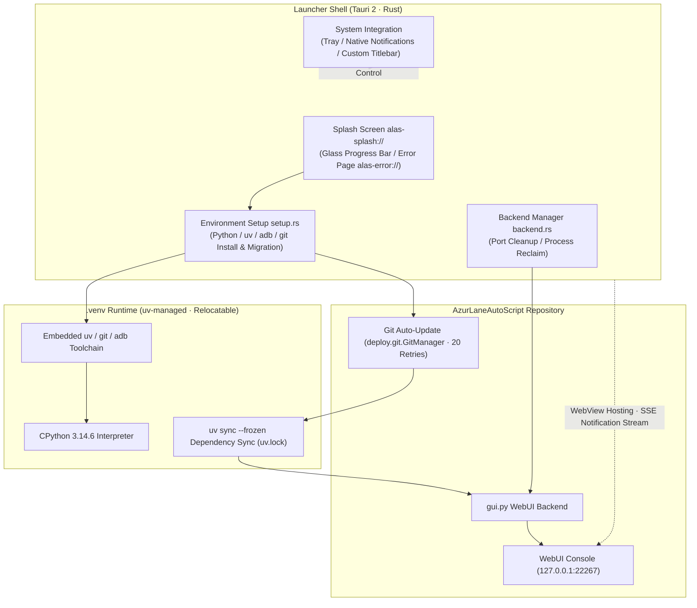

<div align="center">


# AzurPilot Launcher

**Native Cross-Platform Runner · Zero-Config Embedded Python · One-Click AzurPilot Launch & Update**

A cross-platform desktop launcher for [AzurPilot](https://github.com/wess09/AzurPilot), the full-featured Azur Lane automation assistant based on [AzurLaneAutoScript](https://github.com/LmeSzinc/AzurLaneAutoScript). Built with Tauri 2 + Rust, running natively on Windows / macOS / Linux.

<p align="center">
  <a href="README.md">简体中文</a> |
  <b>English</b> |
  <a href="README_ja.md">日本語</a> |
  <a href="README_zh-TW.md">繁體中文</a>
</p>

---

<!-- Core environment and platform badges -->
<p align="center">
  <a href="./LICENSE"></a>
  <a href="https://www.tauri.app/"></a>
  <a href="https://www.rust-lang.org/"></a>
  <a href="https://www.python.org/"></a>
  <a href="https://github.com/astral-sh/uv"></a>
  
</p>

<!-- Tech stack and framework badges -->
<p align="center">
  <a href="https://developer.mozilla.org/en-US/docs/Web/API/Web_Workers_API"></a>
  
  
  
  <a href="https://deepwiki.com/wess09/AzurPilotLauncher"></a>
</p>

<!-- Repository dynamics and community metric badges -->
<p align="center">
  <a href="https://github.com/wess09/AzurPilotLauncher/releases/latest"></a>
  <a href="https://github.com/wess09/AzurPilotLauncher/releases"></a>
  <a href="https://github.com/wess09/AzurPilotLauncher/stargazers"></a>
  <a href="https://github.com/wess09/AzurPilotLauncher/network/members"></a>
  <a href="https://github.com/wess09/AzurPilotLauncher/issues"></a>
  <a href="https://github.com/wess09/AzurPilotLauncher/commits/main"></a>
</p>

<p align="center">
  <a href="#project-overview-and-metrics">Overview</a> •
  <a href="#project-description">About</a> •
  <a href="#related-ecosystem-projects">Ecosystem</a> •
  <a href="#key-features">Features</a> •
  <a href="#system-architecture">Architecture</a> •
  <a href="#system-requirements">Requirements</a> •
  <a href="#quick-start">Quick Start</a> •
  <a href="#app-preview">Preview</a> •
  <a href="#differences-from-the-original-launcher">Changes</a> •
  <a href="#directory-layout">Layout</a> •
  <a href="#development-activity">Activity</a> •
  <a href="#star-growth-trend">Star Trend</a> •
  <a href="#community-and-support">Community</a>
</p>

</div>

---

## Project Overview and Metrics

<table width="100%">
  <thead>
    <tr>
      <th colspan="4" align="left">
        
        <b>Core Runtime &amp; Development Metrics</b>
      </th>
    </tr>
  </thead>
  <tbody>
    <tr>
      <td width="25%"><b>Latest Release</b><br><a href="https://github.com/wess09/AzurPilotLauncher/releases/latest"></a></td>
      <td width="25%"><b>Total Downloads</b><br><a href="https://github.com/wess09/AzurPilotLauncher/releases"></a></td>
      <td width="25%"><b>Open Source License</b><br><a href="./LICENSE"></a></td>
      <td width="25%"><b>Automated Build</b><br><a href="https://github.com/wess09/AzurPilotLauncher/actions"></a></td>
    </tr>
    <tr>
      <td width="25%"><b>Repository Size</b><br></td>
      <td width="25%"><b>Code Language</b><br></td>
      <td width="25%"><b>Runtime</b><br></td>
      <td width="25%"><b>UI Languages</b><br></td>
    </tr>
    <tr>
      <td colspan="4">
        <b>Quick Actions:</b>
        <a href="https://github.com/wess09/AzurPilotLauncher/releases/latest"></a>
        <a href="https://deepwiki.com/wess09/AzurPilotLauncher"></a>
        <a href="https://github.com/wess09/AzurPilotLauncher/issues/new/choose"></a>
        <a href="https://github.com/wess09/AzurPilotLauncher/pulls"></a>
        <a href="https://github.com/wess09/AzurPilotLauncher/stargazers"></a>
      </td>
    </tr>
  </tbody>
</table>

---

## Project Description

**AzurPilot Launcher** makes the full-featured Azur Lane automation assistant **AzurPilot** run natively with one click on Windows, macOS and Linux — whether on an Apple Silicon Mac Mini or a classic x86 machine, with no translation layers, no Docker, and no pollution of your system environment.

The launcher embeds the `uv` package manager and, on first run, automatically creates a relocatable `.venv` (Python 3.14.6), pulls the latest code via git, syncs dependencies, then starts the Python WebUI backend inside a native WebView shell — complete with a splash screen, system tray, desktop notifications and a custom title bar. The UI supports four languages (Simplified Chinese, Traditional Chinese, Japanese and English), selected automatically from the system locale.

---

## Related Ecosystem Projects

This project works closely with the following core projects in its ecosystem:

<table width="100%">
  <tr>
    <td width="33%" valign="top">
      <div align="center">
        <a href="https://github.com/wess09/AzurPilotLauncher">
          
        </a>
      </div>
      <br>
      <b>Cross-Platform Launcher (this project)</b>
      <p>An all-in-one desktop launcher for Windows / macOS / Linux, covering environment setup, code updates, dependency sync and WebUI lifecycle management.</p>
      <hr>
      <div>
        
        
        
      </div>
    </td>
    <td width="33%" valign="top">
      <div align="center">
        <a href="https://github.com/wess09/AzurPilot">
          
        </a>
      </div>
      <br>
      <b>Core Automation Engine</b>
      <p>The Azur Lane automation assistant core, featuring complete computer-vision recognition, sortie scheduling algorithms and a local web console service.</p>
      <hr>
      <div>
        
        
        
      </div>
    </td>
    <td width="33%" valign="top">
      <div align="center">
        <a href="https://github.com/LmeSzinc/AzurLaneAutoScript">
          
        </a>
      </div>
      <br>
      <b>Upstream Automation Script (ALAS)</b>
      <p>The upstream AzurLaneAutoScript project — the foundation of Azur Lane automation, from which this ecosystem's capabilities evolved.</p>
      <hr>
      <div>
        
        
        
      </div>
    </td>
  </tr>
</table>

---

## Key Features

<table width="100%">
  <tr>
    <td width="50%" valign="top">
      <br>
      <h3>Zero-Config Environment Setup</h3>
      <p>The launcher embeds <code>uv</code>. On first run it automatically downloads Python 3.14.6 and creates a <b>relocatable <code>.venv</code></b>, deploying uv, git and adb into the same virtual environment. No pre-installed Python, uv or Git required — it just works out of the box.</p>
      <div>
        
        
        
      </div>
    </td>
    <td width="50%" valign="top">
      <br>
      <h3>Native Desktop Shell Experience</h3>
      <p>A native WebView shell built on Tauri 2: glassmorphism splash screen and custom title bar, system tray, Windows Toast / macOS / Linux native notifications, and single-instance behavior — relaunching simply focuses the existing window.</p>
      <div>
        
        
        
      </div>
    </td>
  </tr>
  <tr>
    <td width="50%" valign="top">
      <br>
      <h3>Automated Update System</h3>
      <p>On launch, the latest code is pulled via git (up to 20 retries), then dependencies are synced exactly with <code>uv sync --frozen</code> against <code>uv.lock</code>. The launcher itself self-updates over an mTLS-secured channel with multi-mirror fallback.</p>
      <div>
        
        
        
      </div>
    </td>
    <td width="50%" valign="top">
      <br>
      <h3>Four-Language Interface</h3>
      <p>Built-in UI localization for 简体中文, 繁體中文, 日本語 and English, chosen automatically from the system locale or forced via the <code>--lang</code> command-line flag. WebUI and web notifications follow the selected language.</p>
      <div>
        
        
        
        
      </div>
    </td>
  </tr>
  <tr>
    <td width="50%" valign="top">
      <br>
      <h3>Dual Mirrors &amp; Direct-Connect Policy</h3>
      <p>Two deployment profiles are provided: the international build and the <code>-cn</code> China-mirror build. Python standalone downloads are accelerated via npmmirror by default. Code updates, embedded Python, uv and dependency installs, plus WebView-to-WebUI connections all bypass the system proxy for a cleaner environment.</p>
      <div>
        
        
        
      </div>
    </td>
    <td width="50%" valign="top">
      <br>
      <h3>Robust Process &amp; Window Management</h3>
      <p>Port-blocking processes are cleaned up before the backend starts. Child processes are tagged via an environment variable and swept from the full process table on exit, so <code>gui.py</code> never leaks. The WebUI opens pre-authenticated through a one-time token — the window is logged in the moment it appears.</p>
      <div>
        
        
        
      </div>
    </td>
  </tr>
</table>

---

## System Architecture

The project follows a cleanly decoupled layered design with well-defined responsibilities and communication boundaries:



---

## System Requirements

<table width="100%">
  <thead>
    <tr>
      <th width="20%">Dimension</th>
      <th width="40%">Requirement</th>
      <th width="40%">Notes</th>
    </tr>
  </thead>
  <tbody>
    <tr>
      <td><b>Operating System</b></td>
      <td>  </td>
      <td>CI builds on an Ubuntu 22.04 / macOS / latest Windows matrix</td>
    </tr>
    <tr>
      <td><b>WebView Runtime</b></td>
      <td>  </td>
      <td>Windows 7/8/10 requires <a href="https://developer.microsoft.com/en-us/microsoft-edge/webview2">WebView2</a> installed first; Linux needs a recent glibc</td>
    </tr>
    <tr>
      <td><b>Python / uv / Git / adb</b></td>
      <td></td>
      <td>The launcher embeds uv, auto-creates the <code>.venv</code>, and deploys git &amp; adb into it</td>
    </tr>
    <tr>
      <td><b>Network</b></td>
      <td></td>
      <td>Needed to download Python, sync dependencies and update the repo; the CN build uses China mirrors</td>
    </tr>
    <tr>
      <td><b>Node.js (Windows only)</b></td>
      <td></td>
      <td>If no system-level Node.js is found, the launcher offers to download and install it (SHA-256 verified)</td>
    </tr>
  </tbody>
</table>

---

## Quick Start

<table width="100%">
  <tr>
    <td width="25%" valign="top">
      <div align="center">
        <br>
        <h4>Get the Archive</h4>
      </div>
      Download the archive <b>matching your OS and CPU</b> (international or CN-mirror build) from the <a href="https://github.com/wess09/AzurPilotLauncher/releases/latest">latest release</a>.
    </td>
    <td width="25%" valign="top">
      <div align="center">
        <br>
        <h4>Extract &amp; Launch</h4>
      </div>
      Run <code>alas-launcher.exe</code> on Windows (administrator required); open <code>AzurPilot.app</code> on macOS; run <code>alas-launcher</code> on Linux.
    </td>
    <td width="25%" valign="top">
      <div align="center">
        <br>
        <h4>Wait for Setup</h4>
      </div>
      The splash screen shows live progress: creating the <code>.venv</code>, updating the repo, syncing dependencies. First launch requires a network connection; subsequent launches simply focus the existing window.
    </td>
    <td width="25%" valign="top">
      <div align="center">
        <br>
        <h4>Enter the WebUI</h4>
      </div>
      The window opens already logged in to the AzurPilot WebUI — configure sortie tasks and schedules and start automated cruising.
    </td>
  </tr>
</table>

> [!TIP]
> The launcher supports command-line flags: `--lang` to force a UI language (`zh-CN` / `zh-TW` / `ja` / `en`), `--skip-update` to skip the repository update, and `--preview-crash` to preview the error page.

> [!WARNING]
> **macOS users**: the app is not signed by a developer certificate. If it fails to open, run `xattr -dr com.apple.quarantine AzurPilot.app` in a terminal first.

> [!IMPORTANT]
> **Linux users**: the launcher depends on `libwebkit2gtk-4.1` and a reasonably recent `glibc` (CI builds on Ubuntu 22.04). If missing system libraries prevent the launcher from running, the AzurPilot core can still be used normally from the command line.

---

## App Preview

| Platform | 简体中文 | English |
|:---:|:---:|:---:|
| **Windows** |  |  |
| **macOS** |  |  |

---

## Differences from the Original Launcher

Compared with the bundled Electron launcher of [AzurLaneAutoScript](https://github.com/LmeSzinc/AzurLaneAutoScript):

| # | Change | Description |
|:---:|:---|:---|
| 1 | **Cross-platform** | No longer Windows-only — runs natively on macOS (including Apple Silicon) and Linux |
| 2 | **Reworked update strategy** | Only the git repo is updated, and dependencies are synced with the uv embedded in `.venv`; relaunching merely refocuses the existing window instead of doing destructive cleanup |
| 3 | **Pinned dependency versions** | Python package versions are locked by `pyproject.toml` and `uv.lock`, with auto-sync enabled by default to prevent environment drift |
| 4 | **adb policy** | adb is no longer restarted or replaced |
| 5 | **Adjusted directory layout** | Python / uv / git / adb all live inside `.venv` — see the layout below |
| 6 | **Node.js automation (Windows)** | Detects system-level Node.js; if absent, offers to download and install it automatically after confirmation |

---

## Directory Layout

```
AzurPilot root directory
* Windows: AzurLaneAutoScript
* macOS:   AzurPilot.app/Contents/AzurLaneAutoScript
* Linux:   AzurLaneAutoScript

AzurPilot launcher
* Windows: AzurLaneAutoScript/alas-launcher.exe
* macOS:   AzurPilot.app/Contents/MacOS/alas-launcher
* Linux:   AzurLaneAutoScript/alas-launcher

Python / uv
* All systems: .venv

Git
* Unix:    .venv/bin/git
* Windows: .venv/Scripts/git/cmd/git.exe

Adb
* Unix:    .venv/bin/adb
* Windows: .venv/Scripts/adb.exe

Environment variables appended by the launcher
* Unix:    .venv/bin
* Windows: .venv/Scripts, .venv/Scripts/git/cmd
```

---

## Development Activity

<table width="100%">
  <thead>
    <tr>
      <th colspan="3" align="left">
        
        <b>Repository Activity &amp; Responsiveness</b>
      </th>
    </tr>
  </thead>
  <tbody>
    <tr>
      <td width="33%">
        <b>Commit Frequency</b><br>
        <br>
        <small>Monthly commit activity</small>
      </td>
      <td width="33%">
        <b>Pull Requests</b><br>
        <br>
        <small>Total closed pull requests</small>
      </td>
      <td width="33%">
        <b>Issues Resolved</b><br>
        <br>
        <small>Total resolved issues</small>
      </td>
    </tr>
    <tr>
      <td width="33%">
        <b>Development Branch</b><br>
        <br>
        <small>Continuous delivery trunk</small>
      </td>
      <td width="33%">
        <b>Automated Builds</b><br>
        <br>
        <small>Three-platform build matrix</small>
      </td>
      <td width="33%">
        <b>Latest Commit</b><br>
        <a href="https://github.com/wess09/AzurPilotLauncher/commits/main"></a><br>
        <small>Tracking the latest evolution</small>
      </td>
    </tr>
  </tbody>
</table>

---

## Star Growth Trend

An adaptive light/dark Star-History chart reflecting the project's growth:

<div align="center">
  <picture>
    <source media="(prefers-color-scheme: dark)" srcset="https://api.star-history.com/svg?repos=wess09/AzurPilotLauncher&type=Date&theme=dark" />
    <source media="(prefers-color-scheme: light)" srcset="https://api.star-history.com/svg?repos=wess09/AzurPilotLauncher&type=Date" />
    
  </picture>
  <br>
  <sub>Live data from <a href="https://star-history.com/#wess09/AzurPilotLauncher&Date">Star-History</a> · click for the interactive full chart</sub>
</div>

---

## Tech Stack and Acknowledgements

### Launcher Tech Stack

| Component | License | Role |
| :--- | :--- | :--- |
| **Tauri 2** |  | Cross-platform desktop shell, WebView hosting and system integration |
| **Rust** |  | Systems programming language powering all native launcher logic |
| **uv** |  | Embedded Python package manager building the relocatable `.venv` |
| **CPython 3.14.6** |  | The Python runtime for the automation engine |
| **Git** |  | Repository updates (compiled from source on Unix / MinGit on Windows) |
| **Android platform-tools** |  | The adb bridge for emulator and device communication |

### Upstream Ecosystem

| Component | License | Role |
| :--- | :--- | :--- |
| **AzurPilot** |  | The core automation engine (what this launcher serves) |
| **AzurLaneAutoScript** |  | The upstream foundation of Azur Lane automation |

---

## Community and Support

<table width="100%">
  <tr>
    <td width="50%" valign="top">
      <div align="center">
        <a href="https://github.com/wess09/AzurPilotLauncher/graphs/contributors">
          
        </a>
        <br><br>
        <h4>Open Source Collaboration</h4>
        <p>Thanks to every developer who has contributed code, improved the architecture, debugged issues or verified features. Feel free to open an Issue or PR to join in!</p>
        <a href="https://github.com/wess09/AzurPilotLauncher/graphs/contributors">
          
        </a>
        <a href="https://github.com/wess09/AzurPilotLauncher/issues/new/choose">
          
        </a>
      </div>
    </td>
    <td width="50%" valign="top">
      <div align="center">
        <a href="https://github.com/wess09/AzurPilotLauncher/stargazers">
          
        </a>
        <br><br>
        <h4>Growth &amp; Support</h4>
        <p>If this launcher makes your automated cruising smoother, please consider starring the repository to support its development.</p>
        <a href="https://star-history.com/#wess09/AzurPilotLauncher&Date">
          
        </a>
      </div>
    </td>
  </tr>
</table>

---

## License

This project is open-sourced under the [GNU General Public License v3.0 (GPL-3.0)](LICENSE) — consistent with AzurPilot, which is also GPLv3.

---

<div align="center">
  <sub>AzurPilot Launcher is open-source and community-driven. For any issues, feel free to open an <a href="https://github.com/wess09/AzurPilotLauncher/issues">Issue</a> or a <a href="https://github.com/wess09/AzurPilotLauncher/pulls">Pull Request</a>.</sub>
</div>
