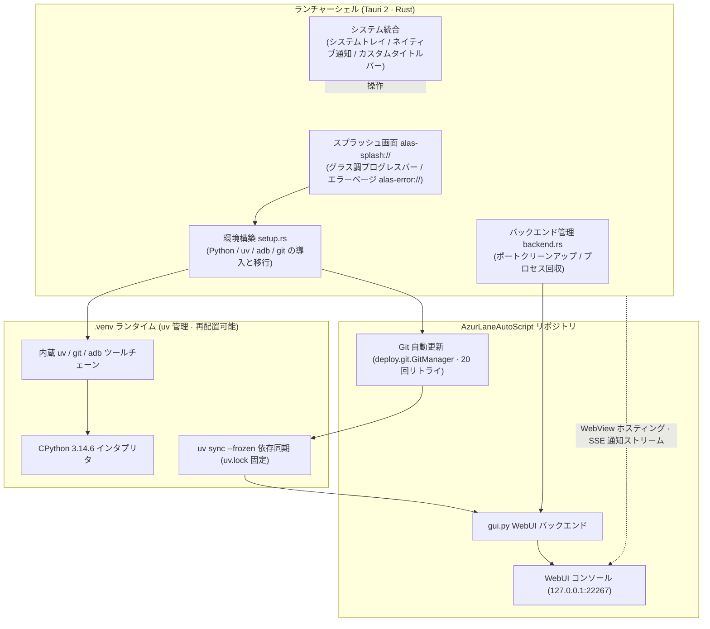

<div align="center">


# AzurPilot Launcher

**マルチプラットフォーム ネイティブ動作 · Python 環境ゼロ設定 · AzurPilot をワンクリックで更新・起動**

フル機能の『アズールレーン』自動化ツール [AzurPilot](https://github.com/wess09/AzurPilot)（[AzurLaneAutoScript](https://github.com/LmeSzinc/AzurLaneAutoScript) ベース）向けのクロスプラットフォーム デスクトップ ランチャー。Tauri 2 + Rust 製で、Windows / macOS / Linux にネイティブ対応しています。

<p align="center">
  <a href="README.md">简体中文</a> |
  <a href="README_en.md">English</a> |
  <b>日本語</b> |
  <a href="README_zh-TW.md">繁體中文</a>
</p>

---

<!-- コア環境およびプラットフォームバッジ -->
<p align="center">
  <a href="./LICENSE"></a>
  <a href="https://www.tauri.app/"></a>
  <a href="https://www.rust-lang.org/"></a>
  <a href="https://www.python.org/"></a>
  <a href="https://github.com/astral-sh/uv"></a>
  
</p>

<!-- 技術スタックおよびフレームワークバッジ -->
<p align="center">
  <a href="https://developer.mozilla.org/ja/docs/Web/API/Web_Workers_API"></a>
  
  
  
  <a href="https://deepwiki.com/wess09/AzurPilotLauncher"></a>
</p>

<!-- リポジトリ指標バッジ -->
<p align="center">
  <a href="https://github.com/wess09/AzurPilotLauncher/releases/latest"></a>
  <a href="https://github.com/wess09/AzurPilotLauncher/releases"></a>
  <a href="https://github.com/wess09/AzurPilotLauncher/stargazers"></a>
  <a href="https://github.com/wess09/AzurPilotLauncher/network/members"></a>
  <a href="https://github.com/wess09/AzurPilotLauncher/issues"></a>
  <a href="https://github.com/wess09/AzurPilotLauncher/commits/main"></a>
</p>

<p align="center">
  <a href="#プロジェクト概要と開発指標">概要指標</a> •
  <a href="#プロジェクト概要">概要</a> •
  <a href="#関連エコシステムプロジェクト">エコシステム</a> •
  <a href="#主な特長">主な特長</a> •
  <a href="#システムアーキテクチャ全景">アーキテクチャ</a> •
  <a href="#動作環境と互換性">動作環境</a> •
  <a href="#クイックスタート">クイックスタート</a> •
  <a href="#アプリプレビュー">プレビュー</a> •
  <a href="#オリジナルランチャーとの違い">変更点</a> •
  <a href="#ディレクトリ構成">構成</a> •
  <a href="#開発アクティビティ">開発状況</a> •
  <a href="#star-の推移">スター推移</a> •
  <a href="#コミュニティとサポート">コミュニティ</a>
</p>

</div>

---

## プロジェクト概要と開発指標

<table width="100%">
  <thead>
    <tr>
      <th colspan="4" align="left">
        
        <b>主要指標・開発状況</b>
      </th>
    </tr>
  </thead>
  <tbody>
    <tr>
      <td width="25%"><b>最新リリース</b><br><a href="https://github.com/wess09/AzurPilotLauncher/releases/latest"></a></td>
      <td width="25%"><b>累計ダウンロード数</b><br><a href="https://github.com/wess09/AzurPilotLauncher/releases"></a></td>
      <td width="25%"><b>オープンソースライセンス</b><br><a href="./LICENSE"></a></td>
      <td width="25%"><b>自動ビルド</b><br><a href="https://github.com/wess09/AzurPilotLauncher/actions"></a></td>
    </tr>
    <tr>
      <td width="25%"><b>リポジトリサイズ</b><br></td>
      <td width="25%"><b>開発言語</b><br></td>
      <td width="25%"><b>ランタイム</b><br></td>
      <td width="25%"><b>UI 言語</b><br></td>
    </tr>
    <tr>
      <td colspan="4">
        <b>クイックアクション：</b>
        <a href="https://github.com/wess09/AzurPilotLauncher/releases/latest"></a>
        <a href="https://deepwiki.com/wess09/AzurPilotLauncher"></a>
        <a href="https://github.com/wess09/AzurPilotLauncher/issues/new/choose"></a>
        <a href="https://github.com/wess09/AzurPilotLauncher/pulls"></a>
        <a href="https://github.com/wess09/AzurPilotLauncher/stargazers"></a>
      </td>
    </tr>
  </tbody>
</table>

---

## プロジェクト概要

**AzurPilot Launcher** は、フル機能の『アズールレーン』自動化アシスタント **AzurPilot** を Windows・macOS・Linux 上でネイティブにワンクリック起動できるようにするプロジェクトです。Apple Silicon の Mac Mini でも、従来の x86 マシンでも、トランスレータも Docker も不要で、システム環境を汚しません。

ランチャーは `uv` パッケージマネージャーを内蔵しており、初回起動時に再配置可能な `.venv`（Python 3.14.6）を自動作成し、git で最新コードを取得して依存関係を同期した後、Python WebUI バックエンドを起動します。ネイティブ WebView シェルがスプラッシュ画面・システムトレイ・デスクトップ通知・カスタムタイトルバーを備えます。UI は簡体字中国語・繁体字中国語・日本語・英語の 4 言語に対応し、システムのロケールから自動選択されます。

---

## 関連エコシステムプロジェクト

本プロジェクトは、以下のエコシステム上の主要プロジェクトと密接に連携しています：

<table width="100%">
  <tr>
    <td width="33%" valign="top">
      <div align="center">
        <a href="https://github.com/wess09/AzurPilotLauncher">
          
        </a>
      </div>
      <br>
      <b>クロスプラットフォーム ランチャー (本プロジェクト)</b>
      <p>Windows / macOS / Linux 向けのオールインワン デスクトップ ランチャー。環境構築・コード更新・依存関係の同期・WebUI のライフサイクル管理を一元的に担います。</p>
      <hr>
      <div>
        
        
        
      </div>
    </td>
    <td width="33%" valign="top">
      <div align="center">
        <a href="https://github.com/wess09/AzurPilot">
          
        </a>
      </div>
      <br>
      <b>自動化エンジン本体</b>
      <p>『アズールレーン』自動化アシスタントのコア。コンピュータビジョンによる画像認識、出撃スケジューリング、ローカル Web コンソールサービスを備えます。</p>
      <hr>
      <div>
        
        
        
      </div>
    </td>
    <td width="33%" valign="top">
      <div align="center">
        <a href="https://github.com/LmeSzinc/AzurLaneAutoScript">
          
        </a>
      </div>
      <br>
      <b>上流自動化スクリプト (ALAS)</b>
      <p>AzurLaneAutoScript の上流プロジェクト。アズールレーン自動化の礎であり、このエコシステムの全自動化機能はここから発展しました。</p>
      <hr>
      <div>
        
        
        
      </div>
    </td>
  </tr>
</table>

---

## 主な特長

<table width="100%">
  <tr>
    <td width="50%" valign="top">
      <br>
      <h3>ゼロ設定の環境構築</h3>
      <p>ランチャーは <code>uv</code> を内蔵し、初回起動時に Python 3.14.6 を自動ダウンロードして<b>再配置可能な <code>.venv</code></b> を作成します。uv・git・adb も仮想環境にまとめてデプロイされるため、Python・uv・Git の事前インストールは一切不要。そのまま動きます。</p>
      <div>
        
        
        
      </div>
    </td>
    <td width="50%" valign="top">
      <br>
      <h3>ネイティブ デスクトップシェル</h3>
      <p>Tauri 2 ベースのネイティブ WebView シェル：グラスモーフィズムのスプラッシュ画面とカスタムタイトルバー、システムトレイ、Windows Toast / macOS / Linux のネイティブ通知、シングルインスタンス動作。再起動時は既存ウィンドウへのフォーカスだけを行います。</p>
      <div>
        
        
        
      </div>
    </td>
  </tr>
  <tr>
    <td width="50%" valign="top">
      <br>
      <h3>自動更新システム</h3>
      <p>起動時に git で最新コードを自動取得（最大 20 回リトライ）し、<code>uv sync --frozen</code> で <code>uv.lock</code> に厳密に沿って依存関係を同期。ランチャー本体も mTLS 保護されたチャネルでセルフアップデートし、複数ミラーへのフォールバックに対応します。</p>
      <div>
        
        
        
      </div>
    </td>
    <td width="50%" valign="top">
      <br>
      <h3>4 言語対応の国際化 UI</h3>
      <p>簡体字中国語・繁体字中国語・日本語・English の 4 言語を内蔵。システムのロケールから自動選択され、<code>--lang</code> 起動オプションでの強制指定にも対応します。WebUI と Web 通知は選択された言語で表示されます。</p>
      <div>
        
        
        
        
      </div>
    </td>
  </tr>
  <tr>
    <td width="50%" valign="top">
      <br>
      <h3>デュアルミラーと直結ポリシー</h3>
      <p>国際版と <code>-cn</code> 中国大陸ミラー版の 2 種類のデプロイ構成を提供。Python standalone のダウンロードは既定で npmmirror による高速化を使用します。コード更新・内蔵 Python・uv・依存関係のインストール、および WebView とローカル WebUI の接続はシステムプロキシをバイパスし、環境干渉を低減します。</p>
      <div>
        
        
        
      </div>
    </td>
    <td width="50%" valign="top">
      <br>
      <h3>堅牢なプロセス・ウィンドウ管理</h3>
      <p>バックエンド起動前にポートを占有するプロセスを自動クリーンアップ。子プロセスは環境変数で所有者をマークし、終了時に全プロセステーブルを走査して回収するため、<code>gui.py</code> がリークしません。WebUI はワンタイムトークンによる事前認証で開き、ウィンドウを開いた瞬間からログイン済みです。</p>
      <div>
        
        
        
      </div>
    </td>
  </tr>
</table>

---

## システムアーキテクチャ全景

プロジェクトはレイヤーごとに明確に分離された設計を採用し、各層の責務と通信境界が明確に定義されています：



---

## 動作環境と互換性

<table width="100%">
  <thead>
    <tr>
      <th width="20%">項目</th>
      <th width="40%">要件</th>
      <th width="40%">備考</th>
    </tr>
  </thead>
  <tbody>
    <tr>
      <td><b>オペレーティングシステム</b></td>
      <td>  </td>
      <td>CI は Ubuntu 22.04 / macOS / 最新 Windows のマトリクスでビルド</td>
    </tr>
    <tr>
      <td><b>WebView ランタイム</b></td>
      <td>  </td>
      <td>Windows 7/8/10 は事前に <a href="https://developer.microsoft.com/zh-cn/microsoft-edge/webview2">WebView2</a> のインストールが必要。Linux は比較的新しい glibc が必要</td>
    </tr>
    <tr>
      <td><b>Python / uv / Git / adb</b></td>
      <td></td>
      <td>ランチャーが uv を内蔵して <code>.venv</code> を自動作成し、git・adb も仮想環境へデプロイ</td>
    </tr>
    <tr>
      <td><b>ネットワーク</b></td>
      <td></td>
      <td>Python のダウンロード、依存関係の同期、リポジトリ更新に必要。CN 版は中国国内ミラーで高速化</td>
    </tr>
    <tr>
      <td><b>Node.js (Windows のみ)</b></td>
      <td></td>
      <td>システムレベルの Node.js が見つからない場合、確認後に自動ダウンロード・インストール（SHA-256 検証付き）</td>
    </tr>
  </tbody>
</table>

---

## クイックスタート

<table width="100%">
  <tr>
    <td width="25%" valign="top">
      <div align="center">
        <br>
        <h4>アーカイブを入手</h4>
      </div>
      <a href="https://github.com/wess09/AzurPilotLauncher/releases/latest">Releases の最新版</a> から、<b>お使いの OS と CPU に合ったアーカイブ</b>（国際版または CN ミラー版）をダウンロードします。
    </td>
    <td width="25%" valign="top">
      <div align="center">
        <br>
        <h4>解凍して起動</h4>
      </div>
      Windows は <code>alas-launcher.exe</code> を実行（管理者権限が必要）。macOS は <code>AzurPilot.app</code> を開く。Linux は <code>alas-launcher</code> を実行します。
    </td>
    <td width="25%" valign="top">
      <div align="center">
        <br>
        <h4>環境初期化を待機</h4>
      </div>
      スプラッシュ画面に進行状況がリアルタイム表示されます：<code>.venv</code> の作成、リポジトリの更新、依存関係の同期。初回起動はネット接続が必要で、2 回目以降は既存ウィンドウへのフォーカスのみです。
    </td>
    <td width="25%" valign="top">
      <div align="center">
        <br>
        <h4>WebUI へアクセス</h4>
      </div>
      ウィンドウを開くと AzurPilot WebUI にログイン済み。出撃タスクとスケジュールを設定して、自動化クルージングを開始しましょう。
    </td>
  </tr>
</table>

> [!TIP]
> ランチャーはコマンドラインオプションに対応しています：`--lang` で UI 言語を強制指定（`zh-CN` / `zh-TW` / `ja` / `en`）、`--skip-update` でリポジトリ更新をスキップ、`--preview-crash` でエラーページをプレビューなど。

> [!WARNING]
> **macOS ユーザーへ**：本アプリは開発者署名されていません。初回起動時にエラーが出る場合は、ターミナルで `xattr -dr com.apple.quarantine AzurPilot.app` を実行してから起動してください。

> [!IMPORTANT]
> **Linux ユーザーへ**：`libwebkit2gtk-4.1` と比較的新しい `glibc` に依存します（CI は Ubuntu 22.04 でビルド）。システムライブラリ不足でランチャーが起動しない場合でも、AzurPilot 本体は通常どおりコマンドラインから利用できます。

---

## アプリプレビュー

| プラットフォーム | 简体中文 | English |
|:---:|:---:|:---:|
| **Windows** |  |  |
| **macOS** |  |  |

---

## オリジナルランチャーとの違い

[AzurLaneAutoScript](https://github.com/LmeSzinc/AzurLaneAutoScript) 同梱の Electron ランチャーと比較して：

| # | 変更点 | 説明 |
|:---:|:---|:---|
| 1 | **マルチプラットフォーム対応** | Windows 限定ではなく、macOS（Apple Silicon ネイティブ含む）と Linux でも動作 |
| 2 | **更新ポリシーの再構築** | git リポジトリの更新のみを行い、依存関係は `.venv` 内蔵の uv で同期。再起動時は既存ウィンドウへのフォーカスのみで、破壊的なクリーンアップは行いません |
| 3 | **依存バージョンの固定** | Python パッケージのバージョンは `pyproject.toml` と `uv.lock` で固定され、自動同期が既定で有効。環境のドリフトを防止します |
| 4 | **adb ポリシー** | adb の再起動・置き換えは行いません |
| 5 | **ディレクトリ構成の変更** | Python / uv / git / adb はすべて `.venv` 内に収められます。詳細は下記の構成を参照 |
| 6 | **Node.js 自動化 (Windows)** | システムレベルの Node.js を検出し、見つからない場合は確認後に自動ダウンロード・インストール |

---

## ディレクトリ構成

```
AzurPilot ルートディレクトリ
* Windows: AzurLaneAutoScript
* macOS:   AzurPilot.app/Contents/AzurLaneAutoScript
* Linux:   AzurLaneAutoScript

AzurPilot ランチャー
* Windows: AzurLaneAutoScript/alas-launcher.exe
* macOS:   AzurPilot.app/Contents/MacOS/alas-launcher
* Linux:   AzurLaneAutoScript/alas-launcher

Python / uv
* 全システム共通: .venv

Git
* Unix:    .venv/bin/git
* Windows: .venv/Scripts/git/cmd/git.exe

Adb
* Unix:    .venv/bin/adb
* Windows: .venv/Scripts/adb.exe

ランチャーが追加する環境変数
* Unix:    .venv/bin
* Windows: .venv/Scripts、.venv/Scripts/git/cmd
```

---

## 開発アクティビティ

<table width="100%">
  <thead>
    <tr>
      <th colspan="3" align="left">
        
        <b>リポジトリ開発アクティビティと対応状況</b>
      </th>
    </tr>
  </thead>
  <tbody>
    <tr>
      <td width="33%">
        <b>コミット頻度</b><br>
        <br>
        <small>月次コミット状況</small>
      </td>
      <td width="33%">
        <b>プルリクエスト対応</b><br>
        <br>
        <small>クローズ済み PR の累計</small>
      </td>
      <td width="33%">
        <b>Issue 解決状況</b><br>
        <br>
        <small>解決済み Issue の統計</small>
      </td>
    </tr>
    <tr>
      <td width="33%">
        <b>開発ブランチ</b><br>
        <br>
        <small>メインブランチ継続デリバリー</small>
      </td>
      <td width="33%">
        <b>自動ビルド</b><br>
        <br>
        <small>3 プラットフォームマトリクスで継続検証</small>
      </td>
      <td width="33%">
        <b>最新コミット</b><br>
        <a href="https://github.com/wess09/AzurPilotLauncher/commits/main"></a><br>
        <small>最新のコード進化を追跡</small>
      </td>
    </tr>
  </tbody>
</table>

---

## Star の推移

ダーク/ライトモードに自動適応する Star-History チャートで、プロジェクトの成長の歩みを可視化しています：

<div align="center">
  <picture>
    <source media="(prefers-color-scheme: dark)" srcset="https://api.star-history.com/svg?repos=wess09/AzurPilotLauncher&type=Date&theme=dark" />
    <source media="(prefers-color-scheme: light)" srcset="https://api.star-history.com/svg?repos=wess09/AzurPilotLauncher&type=Date" />
    
  </picture>
  <br>
  <sub>データは <a href="https://star-history.com/#wess09/AzurPilotLauncher&Date">Star-History</a> よりリアルタイム更新 · クリックでインタラクティブな全体チャートを表示</sub>
</div>

---

## 技術スタックと依存関係の謝辞

### ランチャー技術スタック

| 依存コンポーネント | ライセンス | 役割 |
| :--- | :--- | :--- |
| **Tauri 2** |  | クロスプラットフォーム デスクトップシェル、WebView ホスティングとシステム統合 |
| **Rust** |  | システムプログラミング言語。ランチャーの全ネイティブロジック |
| **uv** |  | 内蔵の Python パッケージマネージャー。再配置可能な `.venv` を構築 |
| **CPython 3.14.6** |  | 自動化エンジンの Python ランタイム |
| **Git** |  | リポジトリのコード更新（Unix はソースビルド / Windows は MinGit） |
| **Android platform-tools** |  | adb ブリッジ。エミュレータ・デバイスとの通信 |

### エコシステム上流

| 依存コンポーネント | ライセンス | 役割 |
| :--- | :--- | :--- |
| **AzurPilot** |  | 自動化エンジン本体（本ランチャーのサービス対象） |
| **AzurLaneAutoScript** |  | アズールレーン自動化の上流となる基盤プロジェクト |

---

## コミュニティとサポート

<table width="100%">
  <tr>
    <td width="50%" valign="top">
      <div align="center">
        <a href="https://github.com/wess09/AzurPilotLauncher/graphs/contributors">
          
        </a>
        <br><br>
        <h4>オープンソース共創</h4>
        <p>コードのコミット、アーキテクチャの改善、問題の調査、機能の検証にご参加いただいたすべての開発者の皆さんに感謝します。Issue や PR でのご参加をいつでも歓迎します！</p>
        <a href="https://github.com/wess09/AzurPilotLauncher/graphs/contributors">
          
        </a>
        <a href="https://github.com/wess09/AzurPilotLauncher/issues/new/choose">
          
        </a>
      </div>
    </td>
    <td width="50%" valign="top">
      <div align="center">
        <a href="https://github.com/wess09/AzurPilotLauncher/stargazers">
          
        </a>
        <br><br>
        <h4>プロジェクトの成長と支援</h4>
        <p>本ランチャーが自動周回のお役に立ったなら、リポジトリに Star を付けてプロジェクトの発展を応援していただけると嬉しいです。</p>
        <a href="https://star-history.com/#wess09/AzurPilotLauncher&Date">
          
        </a>
      </div>
    </td>
  </tr>
</table>

---

## ライセンス

本プロジェクトは [GNU General Public License v3.0 (GPL-3.0)](LICENSE) のもとでオープンソースとして公開されています。AzurPilot が GPLv3 採用のため、本ランチャーも同様に GPLv3 です。

---

<div align="center">
  <sub>AzurPilot Launcher はオープンソースライセンスに基づきコミュニティによってメンテナンスされています。問題があれば <a href="https://github.com/wess09/AzurPilotLauncher/issues">Issue</a> または <a href="https://github.com/wess09/AzurPilotLauncher/pulls">Pull Request</a> をお気軽にどうぞ。</sub>
</div>
