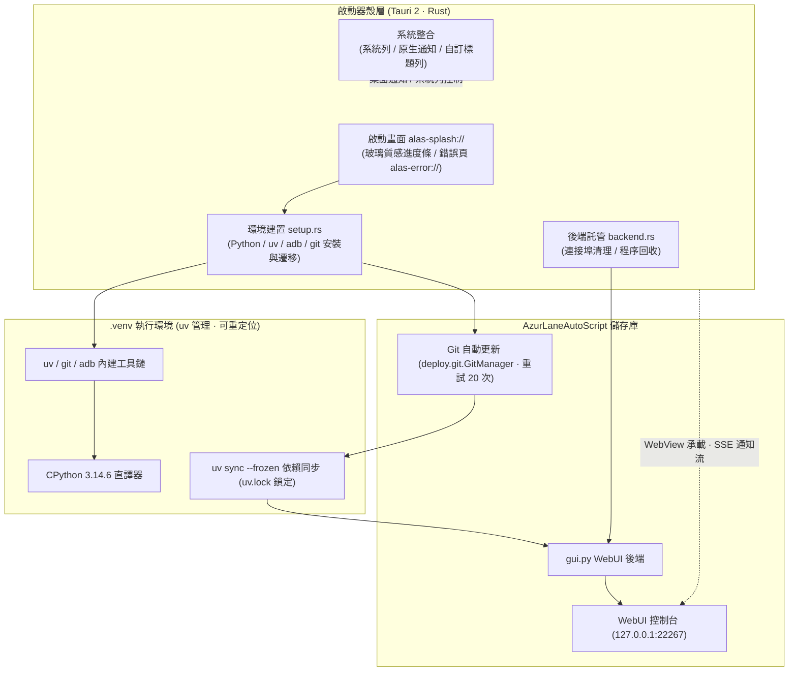

<div align="center">


# AzurPilot Launcher

**全平台原生執行 · 內建 Python 環境零設定 · 一鍵更新啟動 AzurPilot**

全功能《碧藍航線》自動化助手 [AzurPilot](https://github.com/wess09/AzurPilot)（基於 [AzurLaneAutoScript](https://github.com/LmeSzinc/AzurLaneAutoScript)）的跨平台桌面啟動器，基於 Tauri 2 + Rust 建構，支援 Windows / macOS / Linux。

<p align="center">
  <a href="README.md">简体中文</a> |
  <a href="README_en.md">English</a> |
  <a href="README_ja.md">日本語</a> |
  <b>繁體中文</b>
</p>

---

<!-- 核心環境與平台標籤組 -->
<p align="center">
  <a href="./LICENSE"></a>
  <a href="https://www.tauri.app/"></a>
  <a href="https://www.rust-lang.org/"></a>
  <a href="https://www.python.org/"></a>
  <a href="https://github.com/astral-sh/uv"></a>
  
</p>

<!-- 技術棧與框架標籤組 -->
<p align="center">
  <a href="https://developer.mozilla.org/zh-TW/docs/Web/API/Web_Workers_API"></a>
  
  
  
  <a href="https://deepwiki.com/wess09/AzurPilotLauncher"></a>
</p>

<!-- 儲存庫動態與社群指標標籤組 -->
<p align="center">
  <a href="https://github.com/wess09/AzurPilotLauncher/releases/latest"></a>
  <a href="https://github.com/wess09/AzurPilotLauncher/releases"></a>
  <a href="https://github.com/wess09/AzurPilotLauncher/stargazers"></a>
  <a href="https://github.com/wess09/AzurPilotLauncher/network/members"></a>
  <a href="https://github.com/wess09/AzurPilotLauncher/issues"></a>
  <a href="https://github.com/wess09/AzurPilotLauncher/commits/main"></a>
</p>

<p align="center">
  <a href="#專案總覽與指標">專案總覽</a> •
  <a href="#專案概述">專案概述</a> •
  <a href="#關聯生態工程">關聯生態</a> •
  <a href="#核心特性">核心特性</a> •
  <a href="#系統架構全景">系統架構</a> •
  <a href="#環境需求">環境需求</a> •
  <a href="#快速開始">快速開始</a> •
  <a href="#應用預覽">應用預覽</a> •
  <a href="#與原版啟動器的差異">版本差異</a> •
  <a href="#目錄結構">目錄結構</a> •
  <a href="#開發活躍度">開發活躍</a> •
  <a href="#star-成長趨勢">成長趨勢</a> •
  <a href="#社群生態與支援">社群支援</a>
</p>

</div>

---

## 專案總覽與指標

<table width="100%">
  <thead>
    <tr>
      <th colspan="4" align="left">
        
        <b>工程核心執行與研發指標</b>
      </th>
    </tr>
  </thead>
  <tbody>
    <tr>
      <td width="25%"><b>最新正式版</b><br><a href="https://github.com/wess09/AzurPilotLauncher/releases/latest"></a></td>
      <td width="25%"><b>累計下載量</b><br><a href="https://github.com/wess09/AzurPilotLauncher/releases"></a></td>
      <td width="25%"><b>開源授權</b><br><a href="./LICENSE"></a></td>
      <td width="25%"><b>自動化建構</b><br><a href="https://github.com/wess09/AzurPilotLauncher/actions"></a></td>
    </tr>
    <tr>
      <td width="25%"><b>儲存庫體積</b><br></td>
      <td width="25%"><b>程式語言</b><br></td>
      <td width="25%"><b>執行環境</b><br></td>
      <td width="25%"><b>介面語言</b><br></td>
    </tr>
    <tr>
      <td colspan="4">
        <b>快速操作快捷入口：</b>
        <a href="https://github.com/wess09/AzurPilotLauncher/releases/latest"></a>
        <a href="https://deepwiki.com/wess09/AzurPilotLauncher"></a>
        <a href="https://github.com/wess09/AzurPilotLauncher/issues/new/choose"></a>
        <a href="https://github.com/wess09/AzurPilotLauncher/pulls"></a>
        <a href="https://github.com/wess09/AzurPilotLauncher/stargazers"></a>
      </td>
    </tr>
  </tbody>
</table>

---

## 專案概述

**AzurPilot Launcher** 致力於讓全功能《碧藍航線》自動化助手 **AzurPilot** 在 Windows、macOS 與 Linux 上以原生方式一鍵執行——無論是 Apple Silicon 的 Mac Mini，還是傳統 x86 主機，都無需轉譯層、無需 Docker、不污染系統環境。

啟動器內嵌 `uv` 套件管理器，首次啟動自動建立可重定位的 `.venv`（Python 3.14.6），經 git 拉取最新程式碼並同步依賴後，啟動 Python WebUI 後端，並以原生 WebView 殼層承載——內建啟動畫面、系統列、桌面通知與自訂標題列。介面支援簡體中文、繁體中文、日語、英語四種語言，依系統環境自動選擇。

---

## 關聯生態工程

本工程與相關聯的核心專案緊密聯動，關鍵依賴與來源專案如下：

<table width="100%">
  <tr>
    <td width="33%" valign="top">
      <div align="center">
        <a href="https://github.com/wess09/AzurPilotLauncher">
          
        </a>
      </div>
      <br>
      <b>跨平台啟動器 (當前專案)</b>
      <p>面向 Windows / macOS / Linux 的一體化桌面啟動器，打通環境建置、程式碼更新、依賴同步與 WebUI 生命週期管理。</p>
      <hr>
      <div>
        
        
        
      </div>
    </td>
    <td width="33%" valign="top">
      <div align="center">
        <a href="https://github.com/wess09/AzurPilot">
          
        </a>
      </div>
      <br>
      <b>核心自動化引擎本體</b>
      <p>《碧藍航線》自動化助手核心，包含完備的電腦視覺圖像識別、出擊調度演算法與本機 Web 控制台服務。</p>
      <hr>
      <div>
        
        
        
      </div>
    </td>
    <td width="33%" valign="top">
      <div align="center">
        <a href="https://github.com/LmeSzinc/AzurLaneAutoScript">
          
        </a>
      </div>
      <br>
      <b>上游自動化腳本 (ALAS)</b>
      <p>AzurLaneAutoScript 上游專案，碧藍航線自動化的奠基之作，本生態鏈的全部自動化能力由此演化而來。</p>
      <hr>
      <div>
        
        
        
      </div>
    </td>
  </tr>
</table>

---

## 核心特性

<table width="100%">
  <tr>
    <td width="50%" valign="top">
      <br>
      <h3>零設定環境建置</h3>
      <p>啟動器內嵌 <code>uv</code>，首次執行自動下載 Python 3.14.6 並建立<b>可重定位的 <code>.venv</code></b>，同時將 uv、git、adb 一併部署進虛擬環境。使用者機器無需預裝 Python、uv 或 Git，開箱即跑。</p>
      <div>
        
        
        
      </div>
    </td>
    <td width="50%" valign="top">
      <br>
      <h3>原生桌面殼層體驗</h3>
      <p>基於 Tauri 2 的原生 WebView 殼：玻璃質感啟動畫面與自訂標題列、系統列、Windows Toast / macOS / Linux 原生通知、單一實例執行，重複啟動自動聚焦已有視窗。</p>
      <div>
        
        
        
      </div>
    </td>
  </tr>
  <tr>
    <td width="50%" valign="top">
      <br>
      <h3>自動化更新體系</h3>
      <p>啟動時經 git 自動拉取最新程式碼（最多重試 20 次），再用 <code>uv sync --frozen</code> 依 <code>uv.lock</code> 精確同步依賴；啟動器本體經 mTLS 安全通道自我更新，支援多鏡像回退。</p>
      <div>
        
        
        
      </div>
    </td>
    <td width="50%" valign="top">
      <br>
      <h3>四語言國際化介面</h3>
      <p>內建簡體中文、繁體中文、日本語、English 四種介面語言，依系統 locale 自動選擇，亦可透過 <code>--lang</code> 啟動參數強制指定。WebUI 與 Web 通知依所選語言在地化呈現。</p>
      <div>
        
        
        
        
      </div>
    </td>
  </tr>
  <tr>
    <td width="50%" valign="top">
      <br>
      <h3>雙鏡像與直連策略</h3>
      <p>提供國際版與 <code>-cn</code> 中國大陸鏡像版兩種部署設定；Python standalone 下載預設走 npmmirror 加速。更新程式碼、內建 Python、uv 與依賴安裝，以及 WebView 與本機 WebUI 的連線均繞過系統代理，減少環境干擾。</p>
      <div>
        
        
        
      </div>
    </td>
    <td width="50%" valign="top">
      <br>
      <h3>穩健的程序與視窗管理</h3>
      <p>啟動後端前自動清理連接埠占用程序；經環境變數標記子程序歸屬，結束時全程序表掃描回收，杜絕 <code>gui.py</code> 殘留；啟動 WebUI 免密直達（一次性權杖預置登入狀態），視窗開啟即已登入。</p>
      <div>
        
        
        
      </div>
    </td>
  </tr>
</table>

---

## 系統架構全景

專案採用清晰的分層解耦設計，各層間職責清晰、通訊邊界規範：



---

## 環境需求

<table width="100%">
  <thead>
    <tr>
      <th width="20%">面向</th>
      <th width="40%">准入指標</th>
      <th width="40%">說明</th>
    </tr>
  </thead>
  <tbody>
    <tr>
      <td><b>作業系統</b></td>
      <td>  </td>
      <td>CI 以 Ubuntu 22.04 / macOS / Windows 最新版矩陣建構</td>
    </tr>
    <tr>
      <td><b>WebView 執行環境</b></td>
      <td>  </td>
      <td>Windows 7/8/10 需先安裝 <a href="https://developer.microsoft.com/zh-cn/microsoft-edge/webview2">WebView2</a>；Linux 需較新 glibc</td>
    </tr>
    <tr>
      <td><b>Python / uv / Git / adb</b></td>
      <td></td>
      <td>啟動器內嵌 uv 並自動建立 <code>.venv</code>，自動部署 git 與 adb 至虛擬環境</td>
    </tr>
    <tr>
      <td><b>網路連線</b></td>
      <td></td>
      <td>下載 Python、同步依賴與更新儲存庫；CN 版走國內鏡像加速</td>
    </tr>
    <tr>
      <td><b>Node.js (僅 Windows)</b></td>
      <td></td>
      <td>未偵測到系統級 Node.js 時，確認後自動下載安裝（SHA-256 驗證）</td>
    </tr>
  </tbody>
</table>

---

## 快速開始

<table width="100%">
  <tr>
    <td width="25%" valign="top">
      <div align="center">
        <br>
        <h4>取得壓縮檔</h4>
      </div>
      前往 <a href="https://github.com/wess09/AzurPilotLauncher/releases/latest">Releases 最新版本</a> 下載<b>對應系統與 CPU 的壓縮檔</b>（國際版或 CN 鏡像版）。
    </td>
    <td width="25%" valign="top">
      <div align="center">
        <br>
        <h4>解壓縮並啟動</h4>
      </div>
      Windows 執行 <code>alas-launcher.exe</code>（需管理員權限）；macOS 開啟 <code>AzurPilot.app</code>；Linux 執行 <code>alas-launcher</code>。
    </td>
    <td width="25%" valign="top">
      <div align="center">
        <br>
        <h4>等待環境初始化</h4>
      </div>
      啟動畫面即時展示進度：建立 <code>.venv</code>、更新儲存庫、同步依賴。首次啟動需連網，之後重複啟動只會聚焦已有視窗。
    </td>
    <td width="25%" valign="top">
      <div align="center">
        <br>
        <h4>進入 WebUI</h4>
      </div>
      視窗開啟即已登入 AzurPilot WebUI，直接設定出擊任務與排程規則，開始自動化巡航。
    </td>
  </tr>
</table>

> [!TIP]
> 啟動器支援 `--lang` 參數強制指定介面語言（`zh-CN` / `zh-TW` / `ja` / `en`），以及 `--skip-update` 跳過儲存庫更新、`--preview-crash` 預覽錯誤頁面等除錯參數。

> [!WARNING]
> **macOS 使用者**：程式未經開發者簽署，首次開啟若報錯，請先在終端機執行 `xattr -dr com.apple.quarantine AzurPilot.app` 再啟動。

> [!IMPORTANT]
> **Linux 使用者**：程式依賴 `libwebkit2gtk-4.1` 與較新的 `glibc`（CI 使用 Ubuntu 22.04 建構）。若系統缺少相關函式庫導致啟動器無法執行，AzurPilot 本體通常仍可透過命令列正常使用。

---

## 應用預覽

| 平台 | 简体中文 | English |
|:---:|:---:|:---:|
| **Windows** |  |  |
| **macOS** |  |  |

---

## 與原版啟動器的差異

相較於 [AzurLaneAutoScript](https://github.com/LmeSzinc/AzurLaneAutoScript) 自帶的 Electron 啟動器：

| # | 差異點 | 說明 |
|:---:|:---|:---|
| 1 | **全平台支援** | 不再局限於 Windows，macOS（含 Apple Silicon 原生）與 Linux 均可執行 |
| 2 | **更新策略重構** | 只更新 git 儲存庫，並用 `.venv` 內建的 uv 同步依賴；重複啟動僅重新聚焦已有視窗，不做破壞性清理 |
| 3 | **依賴版本鎖定** | Python 套件版本由 `pyproject.toml` 與 `uv.lock` 鎖定，自動同步預設啟用，杜絕環境漂移 |
| 4 | **adb 策略** | 不再重新啟動與替換 adb |
| 5 | **目錄結構調整** | Python / uv / git / adb 全部收納進 `.venv`，詳見下方目錄結構 |
| 6 | **Node.js 自動化 (Windows)** | 偵測系統級 Node.js；未偵測到時可在確認後自動下載並安裝 |

---

## 目錄結構

```
AzurPilot 根目錄
* Windows: AzurLaneAutoScript
* macOS:   AzurPilot.app/Contents/AzurLaneAutoScript
* Linux:   AzurLaneAutoScript

AzurPilot 啟動器
* Windows: AzurLaneAutoScript/alas-launcher.exe
* macOS:   AzurPilot.app/Contents/MacOS/alas-launcher
* Linux:   AzurLaneAutoScript/alas-launcher

Python / uv
* 所有系統: .venv

Git
* Unix:    .venv/bin/git
* Windows: .venv/Scripts/git/cmd/git.exe

Adb
* Unix:    .venv/bin/adb
* Windows: .venv/Scripts/adb.exe

啟動器會附加的環境變數
* Unix:    .venv/bin
* Windows: .venv/Scripts、.venv/Scripts/git/cmd
```

---

## 開發活躍度

<table width="100%">
  <thead>
    <tr>
      <th colspan="3" align="left">
        
        <b>儲存庫開發活躍度與回應態勢</b>
      </th>
    </tr>
  </thead>
  <tbody>
    <tr>
      <td width="33%">
        <b>程式碼提交頻度</b><br>
        <br>
        <small>月度提交活躍狀態</small>
      </td>
      <td width="33%">
        <b>合併請求處理</b><br>
        <br>
        <small>已歸檔合併請求總計</small>
      </td>
      <td width="33%">
        <b>問題回報解決</b><br>
        <br>
        <small>已成功解決 Issue 統計</small>
      </td>
    </tr>
    <tr>
      <td width="33%">
        <b>開發分支</b><br>
        <br>
        <small>主幹持續交付流</small>
      </td>
      <td width="33%">
        <b>自動化建構</b><br>
        <br>
        <small>三平台矩陣持續驗證</small>
      </td>
      <td width="33%">
        <b>最新提交紀錄</b><br>
        <a href="https://github.com/wess09/AzurPilotLauncher/commits/main"></a><br>
        <small>追蹤最新程式碼演進</small>
      </td>
    </tr>
  </tbody>
</table>

---

## Star 成長趨勢

採用自適應深淺模式的 Star-History 矢量歷史圖譜，直觀反映專案發展脈絡：

<div align="center">
  <picture>
    <source media="(prefers-color-scheme: dark)" srcset="https://api.star-history.com/svg?repos=wess09/AzurPilotLauncher&type=Date&theme=dark" />
    <source media="(prefers-color-scheme: light)" srcset="https://api.star-history.com/svg?repos=wess09/AzurPilotLauncher&type=Date" />
    
  </picture>
  <br>
  <sub>資料來源基於 <a href="https://star-history.com/#wess09/AzurPilotLauncher&Date">Star-History</a> 即時更新 · 點擊可檢視互動式完整走勢</sub>
</div>

---

## 技術棧與依賴致謝

### 啟動器技術棧

| 依賴元件 | 授權標識 | 職責定位 |
| :--- | :--- | :--- |
| **Tauri 2** |  | 跨平台桌面殼、WebView 承載與系統整合 |
| **Rust** |  | 系統程式語言，啟動器全部原生邏輯 |
| **uv** |  | 內嵌的 Python 套件管理器，建構可重定位 `.venv` |
| **CPython 3.14.6** |  | 自動化引擎的 Python 執行環境 |
| **Git** |  | 儲存庫程式碼更新（Unix 源碼編譯 / Windows MinGit） |
| **Android platform-tools** |  | adb 除錯橋，模擬器與裝置通訊 |

### 生態上游

| 依賴元件 | 授權標識 | 職責定位 |
| :--- | :--- | :--- |
| **AzurPilot** |  | 核心自動化引擎本體（本啟動器的服務對象） |
| **AzurLaneAutoScript** |  | 碧藍航線自動化的上游奠基專案 |

---

## 社群生態與支援

<table width="100%">
  <tr>
    <td width="50%" valign="top">
      <div align="center">
        <a href="https://github.com/wess09/AzurPilotLauncher/graphs/contributors">
          
        </a>
        <br><br>
        <h4>開源共建與參與</h4>
        <p>感謝所有參與程式碼提交、架構改進、問題排查與功能驗證的開發者。歡迎隨時提交 Issue 與 PR 參與共建！</p>
        <a href="https://github.com/wess09/AzurPilotLauncher/graphs/contributors">
          
        </a>
        <a href="https://github.com/wess09/AzurPilotLauncher/issues/new/choose">
          
        </a>
      </div>
    </td>
    <td width="50%" valign="top">
      <div align="center">
        <a href="https://github.com/wess09/AzurPilotLauncher/stargazers">
          
        </a>
        <br><br>
        <h4>專案成長與支援</h4>
        <p>如果本啟動器為你的掛機體驗帶來了便利，歡迎前往儲存庫首頁點亮 Star 支援專案演進。</p>
        <a href="https://star-history.com/#wess09/AzurPilotLauncher&Date">
          
        </a>
      </div>
    </td>
  </tr>
</table>

---

## 授權條款

本專案採用 [GNU General Public License v3.0 (GPL-3.0)](LICENSE) 授權開源——因為 AzurPilot 採用 GPLv3，本啟動器與其保持一致。

---

<div align="center">
  <sub>AzurPilot Launcher 遵守開源授權並由社群驅動維護。如遇問題歡迎提交 <a href="https://github.com/wess09/AzurPilotLauncher/issues">Issue</a> 或 <a href="https://github.com/wess09/AzurPilotLauncher/pulls">Pull Request</a>。</sub>
</div>
